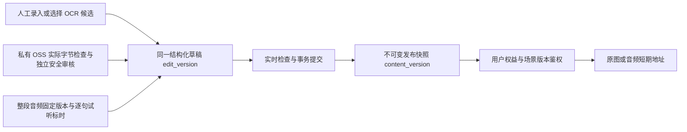

# V1.3 内容生产与音频改版技术方案

日期：2026-10-01。用户已批准完整计划：三个项目 main 开发、小程序前端延期；不默认推送或部署。

## 数据与接口契约

复用 scene/scene_revision、audio_target/audio_version、media_asset 和版本快照。草稿 version 是乐观锁 edit_version；发布 content_version 独立，revision_id 固定不可变。同一版本固定所有资源版本，不追随 audio_target.active_version_id。

结构化 content 字段：title_en、title_zh、summary、tags、original_image_asset_id、cover_asset_id、copyright、source、audio（target_id/version_id/asset_id/duration_ms，允许 null）、dialogue、vocabulary、chunks。草稿全部允许未齐；发布强校验。

dialogue 行：id、speaker、english、chinese、start_ms、end_ms（允许 null）、audio_version_id（允许 null）、timing_confirmed（默认 false）、clickable_spans（服务端生成）。句子 id 由服务端或客户端创建稳定 ULID/UUID；移动或修改文字保留 id。更换 audio.version_id 清空全部标时与确认。

vocabulary/chunks 行：entry_id、entry_version、english、variants、phonetic、chinese、explanation、source_sentence_ids、icon_asset_id、audio_target_id、audio_version_id（后三项可空）。全局词库按类型与规范英文复用，版本不可变；草稿引用固定版本。片段含 entry_id/entry_version/source_locator/start/end，按 Unicode 字符偏移，语块优先，跨行人工配置落点。

管理 content 路由：GET/POST /series；POST /scenes（series_id/template_type）；既有 revisions GET/PUT（content 类型化）；GET/POST /lexicon、PUT /lexicon/{id}；preview/publish-checks/publish 使用同一草稿和实时事实。发布请求 expected_version 防检查后保存竞态。media 路由保留当前上传策略、确认、音频目标与版本接口，增加素材 metadata、管理员试听、安全额度与 OCR 状态。

public scene 使用 scene_id/revision_id/content_version/content，content 为上述公开白名单。词卡须携带 revision_id、entry_version、source_locator。新增场景资源签名接口必须确认资源属于该版本并重验权益。只读预览无原图/正文/音频/时间点/片段。

## 实施与验收

批次1模型与迁移；2统一编辑/词库/实际素材校验；3百度OCR及额度；4标时/预览/原子发布；5用户后端与统一枚举/不限量；6批量实际执行、统计生命周期、全链路。

百度OCR默认关闭。仅服务端读取管理员学习原图，调用 general，language_type=CHN_ENG、paragraph=true、probability=true。内部额度数据库事务预占；worker 认领一次，超时计数且不重试；人工重试使用新幂等键。候选字段选择采纳与 expected_version 校验。

可信素材验证计算字节哈希、真实解码尺寸/时长，独立内容安全未通过不得确认。整段音频和时间点必填；独立词条发音可空。本期禁止TTS执行。

测试：三个项目完整质量门禁、独立MySQL/Redis、真实loopback HTTP、浏览器1440×900/1280×800。外部凭据/额度/CORS/内容安全验收缺失独立报告，小程序前端与微信真机延期。

## 事务与数据归属

管理后端持有场景、发布快照、词库、媒体、正式/限时权益、反馈与统计汇总；用户后端持有身份、学习、收藏复习、联系方式、消息和注销申请。服务间仍采用 HMAC 时间窗与一次性 nonce，不新增微服务。用户成功操作与匿名业务事件在同一个数据库事务内提交，跨域操作通过现有 outbox 与补偿重试完成。

迁移 `0015` 增加词库/词条版本、场景素材引用、OCR 配额/预占及匿名事件表，扩展素材真实尺寸/时长/安全任务 ID、批量任务参数/结果、收藏来源固定版本。已有正式期限增量转换为小写，并以区分大小写的约束限定六个值。句子编号扩宽至 64，防止 UUID 被截断。应用最低 schema 为 15；迁移独立运行，不由 API 启动隐式执行，不清库。

草稿保存锁定场景和修订行，检查 expected_version、修订可编辑状态；词库解析、正文快照、句子/词条/来源与素材引用投影在同一事务提交。系列默认安全封面在保存时固定到快照，后续系列封面变化不影响已发布版本。词库按类型及规范英文复用；修改固定版本的内容创建新版本，过期词库修改返回冲突。词形按人工输入维护；发布匹配不接外部词典。

发布首先提供当前检查结果供管理员校对，提交时再次锁定场景与草稿、读取实际素材/音频版本并重复所有强检查，校验词条固定版本与快照一致，再整体切换 published_revision_id；幂等结果与切换在同一事务保存。发布版本只读，修改/回退均建立候选草稿再发布。批量恢复下线内容同样在状态切换事务内重读固定快照与素材检查，防止检查后素材状态变化。不会依赖旧 publish_check_result，也不把空检查列表视为有效发布。

## 素材与 OCR 的执行边界

上传策略按管理员/素材类型限定 object key 前缀及大小；确认时服务端限定最大读取量，从私有 OSS 流逐块读取、计算实际 SHA-256。Pillow 完整解码图片；ffprobe 读取帧并核验音频真实时长，空帧/无法解码/错误输出均拒绝。OSS 自定义元数据、文件名、客户端 hash、扩展名不能替代检查。真实尺寸/时长写入 media_asset，安全检查单独进行，UNKNOWN/PENDING/FAILED 不可确认和签名。

阿里云安全适配使用图片审核与异步音频任务。音频安全 TaskId 持久化到素材，重复确认只查询同一任务。默认安全 provider disabled；local provider 只能在 local/test 且显式 fixtures-only 开启时处理 `/fixtures/` 合成素材。测试安全门禁不能作为真实供应商验收证据。

百度调用前校验 jpg/png/bmp、边长 15–4096 像素与表单编码后的请求体限制；服务端向 general 含位置接口发送真实图片数据，申请 CHN_ENG、paragraph、probability。保留原始文本、坐标、置信度及段落索引，后台允许人工整理候选和逐字段选择。採纳使用原草稿 expected_version，只合并选中字段；版本变化返回冲突，保留人工输入。

OCR 开启需要 provider 凭据和数据库当月额度核验配置。预占先在数据库锁内检查月度内部上限和核验额度，再记录唯一 reservation；worker 对待执行任务只认领一次，结果不明也占用次数，不自动重调付费接口。重新识别/失败重试必须由管理员创建新命令与预占。账户实际免费资源及付费状态需要控制台确认，不能以本地数字代替真实账户额度。

## 音频与来源定位

每句必须引用场景同一个 audio.version_id，区间满足 0≤start_ms<end_ms≤真实 duration_ms，且经过人工试听确认。后台只有一个区间播放器，切换句子、音频或页面即停止前一个；数值微调后重新确认。新音频版本不会复用旧标时，独立词/语块发音保持 nullable，TTS 入口及任务执行关闭。

clickable_spans 的偏移使用 Python/Unicode 字符位置；小程序后续 JS 消费需按 Unicode code point 切分，不可直接假定所有字符占一个 UTF-16 code unit。来源定位为 `sentence:{稳定句子ID}:entry:{固定词条ID}`，不含排序号，移动句子不改变来源。跨行语块只对管理员显式确认的句子匹配，片段共享来源定位，词卡/收藏保留全部相关句子的英文上下文。列表词汇/语块使用 `vocabulary:{entry_id}`、`chunks:{entry_id}`，没有句子时以权威词条英文作为快照；不信任客户端文字。

资源解析只查请求场景修订实际引用的 asset_id、audio_version_id 或 target_id，再检查素材真实状态。用户每次签名重新校验权益与当前发布修订；暂停、过期、下线、错版本、无引用均拒绝。签名期限不超过权益最早到期时间，响应 no-store。独立安全封面不能与完整学习原图使用同一素材引用，预览白名单包含双语标题、系列、摘要、许可封面，不包含正文、原图、词条释义、标时或音频。

## 批量、统计与生命周期

批量任务与各项参数持久化，通过真实 Celery `content.publish` 队列执行标签、版权、内容包、校验、发布、下线、恢复及导出。任务/项目有独立认领，逐项记录结果与审计；成功项不因其他失败回滚，取消只影响尚未开始项。发布参数携带每个场景 expected_versions，变更后的草稿返回冲突。导出为固定正文与资源 ID，不含短期签名 URL 或个人资料。

统计记录可靠业务事件与 cohort 日期：北京时间日、周一至周日自然周、自然月各自去重。局部日期范围显示人天，整自然周期显示独立活跃人数，响应 activity_basis 明确口径；状态分布使用周期最后快照，首次反馈响应显示累计秒数/响应数量。每天 01:00 汇总前一日并回补受影响历史 cohort，显式回补幂等；第21章逐项事件和指标见需求实现矩阵及 stats 验收文档。

截图清理保护任何仍受素材/场景引用保护的对象；草稿回收站保留期后清除修订及引用。注销补偿独立于用户端成功响应，通过 outbox 驱动管理域清理并回调；匿名事件移除 user_id 且改写 event_key，聚合不保留可追溯身份。需要小程序曝光触发的接口先完成后端，实际曝光与真机播放随前端延期验收。

## 外部待验收与交付

最终证据把“代码实现、自动测试、真实本地服务、外部验收”分别标注。测试 OSS 上传/读回已用于真实网络验证，但浏览器直传被当前 bucket CORS 阻断；浏览器人工编辑/预览/标时/发布与用户 API 读取可用 HTTP 上传合成素材继续验证，并明确记录这种路径。合成静音文件只证明时长/播放器边界，不证明真人句子对齐质量。

百度账户核验、真实 OCR 返回质量、真实阿里云内容安全、生产 CORS/HTTPS、真实版权素材、微信权限/录音及手机平板真机音频均不由本地 fixture 测试证明。小程序前端代码本轮不修改，最终设计稿到位后按本次接口版本实施；三个仓库只提交本地 main，不默认推送或部署生产。
