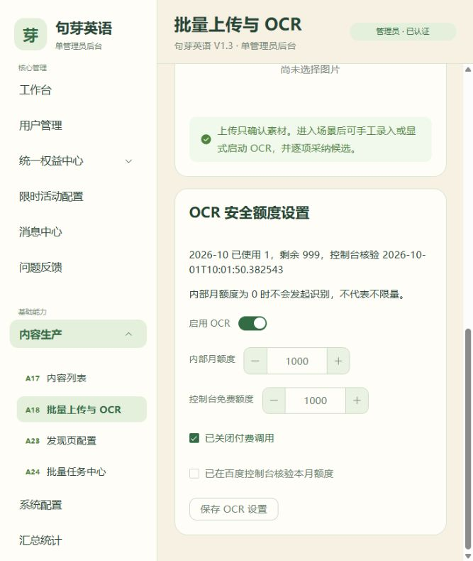

# OCR 设置保存修复（2026-10-01）

用户在 `5173` 保存 OCR 配置，后端返回 `VALIDATION_ERROR`，指出请求头缺少 `X-Idempotency-Key`。前端 OCR adapter 没有传递命令键，而后端 PUT 路由要求此请求头。

修复：adapter 接受显式键并为独立调用生成默认键；设置页面使用现有幂等命令控制器，同一输入失败重试保留键，成功后或输入实质变化后产生新键。保存期间禁用设置输入和重复提交。页面说明内部月额度为 0 表示不允许调用。

真实服务验证又发现配置已保存但审计写入返回 500：`quota_verified_at`、`updated_at` 是 datetime，直接进入审计 JSON 序列化失败。OCR 配置审计记录在写入前使用 FastAPI JSON encoder 转为可序列化摘要。HTTP 回归测试要求审计摘要可以进行标准 JSON 序列化，覆盖核验时间、更新时间、必需请求头和零额度无识别调用。

验证：前端新增两项回归修复前失败、修复后通过；前端 check、236 单元测试及生产构建通过。媒体相关 Chromium 5 项通过，包含保存失败重试、成功后新键及修改输入后新键。后端新增审计回归复现 datetime 错误后修复，完整隔离 MySQL/Redis pytest 295 passed、3 skipped，Ruff、格式和 mypy 通过。

真实浏览器验证 `http://127.0.0.1:5173` 与 `http://127.0.0.1:18173`：登录、读取额度、保持原设置保存，均返回 200，携带 CSRF 和幂等头；未发起图片识别。5173 对应的本地 API 镜像已更新，运行环境配置保持原值，其他服务未更新；独立 18000 API 已重启加载源码修复。

该修复证明设置保存链路通过。`monthly_limit=0` 仍阻断识别；免费额度、内部正数上限和运行进程的百度 provider 配置是实际识别的独立条件。本次没有修改调用额度或启用真实 OCR，也不构成真实 OCR 识别验收。数据库核验/更新字段和审计记录属于正常保存操作的元数据。

## 2026-10-08：保存后开关显示关闭

实际数据库中 `enabled=1`、`paid_disabled=1`，但 MySQL 原始查询返回整数。`OcrSettings` dataclass 不执行运行时类型转换，接口因此返回数字 `1`，而 Element Plus 开关和复选框按布尔值判断选中状态，导致保存成功后重新读取仍显示关闭。

修复在 SQL 仓储的 `_settings` 转换处将两个开关统一转换为布尔值，保存响应和额度查询均返回 `true/false`。新增独立 MySQL 回归覆盖开启、关闭后保存和新服务实例重新读取；修复前分别失败于 `1 is True`、`0 is False`，修复后媒体持久化 3 项通过。完整隔离后端测试 396 passed、4 skipped；Ruff lint 全库通过，本次修改文件格式检查及 quota 模块 mypy 通过。

完整格式检查仍有既存问题：`integrations/oss/provider.py`、`modules/access_policy/router.py`、`modules/contacts/service.py`、`modules/media/service.py`。完整 mypy 仍被 `modules/formal_entitlements/router.py:147` 的既存无效 type 注释阻断；本次未修改这些文件。

本地 `8000` API 已更新为 `juya-admin-ocr-boolean-local:20261008`，更新前后全部运行环境变量和网络保持一致，健康检查返回 200。真实浏览器在 `http://127.0.0.1:5173/content/import` 将开关关闭再开启、点击保存收到成功提示，刷新页面后 OCR 与付费关闭复选框仍选中。内部及免费月额度保持 1000，已使用次数仍为 1；未发起图片识别。

